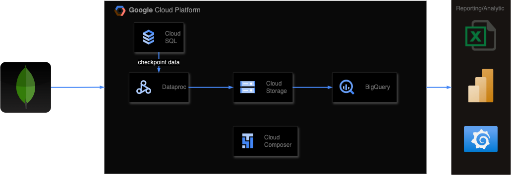

# **MongoDB to BigQuery ETL Pipeline with Churn Analysis Report**



This project provides a **data pipeline** to extract data from **MongoDB collections**, transform it using **PySpark**, store the intermediate results in **Google Cloud Storage (GCS)**, and load the final data into **BigQuery**. Additionally, it includes a **churn analysis report** that runs weekly in **Airflow** to track new, cancelled, and terminated subscriptions.

---

## **Prerequisites**

1. **Google Cloud Platform (GCP) Setup:**
   - A GCP project with **BigQuery** and **Cloud Storage** enabled.
   - Service account with appropriate permissions for BigQuery, GCS, and Airflow.

2. **Airflow Setup:**
   - Airflow instance (can use **Cloud Composer** or a local Airflow setup).
   - Configure Airflow connections:
     - **Spark Connection:** For running PySpark jobs.
     - **GCP Connection:** For interacting with BigQuery and GCS.

3. **Python Packages:**  
   Install the following packages for PySpark if running locally:
   ```bash
   pip install -r requirements.txt
   ```


## **Setup Instructions**
1. **Clone the Repository:**

    ```bash
    git clone <repository-url>
    cd <repository-folder>
    ```
2. **Update Configuration:**

    - Edit the MongoDB URI in the PySpark scripts (mongodb_to_gcs.py and parse_billing_period.py).
    - Update GCS bucket names and BigQuery dataset names in the scripts and DAGs.
3. **Upload SQL Query to Airflow DAG Folder:**

    Place the churn_analysis.sql file under sql/ and point to its path in the churn report DAG.

## **How to Run**
1. Deploy Airflow DAGs:

    - Place the DAGs (mongodb_to_bigquery_dag.py and churn_report_dag.py) into your Airflow dags/ folder.
2. Test PySpark Scripts:

    - Run the PySpark scripts locally to ensure connectivity with MongoDB and GCS:
        ```bash
        spark-submit scripts/mongodb_to_gcs.py
        spark-submit scripts/parse_billing_period.py
        ```

3. Trigger DAGs in Airflow:

    - Start the Airflow webserver and scheduler.
    - Trigger the DAGs manually or wait for the scheduled interval.
4. Monitor DAGs:
    - Use the Airflow UI to monitor pipeline execution and review logs for failures.